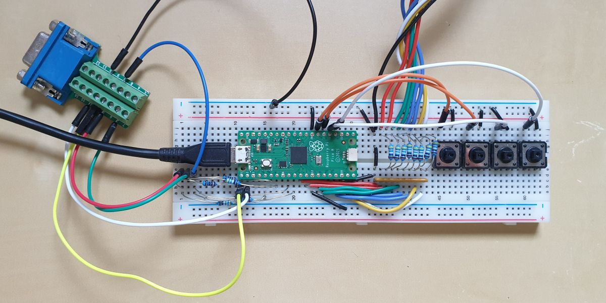

PICO TTL2VGA
==

### RPi Pico  TTL to VGA Converter  

Simple TTL (MDA/CGA/EGA) to VGA converter based on RPi Pico.<br />
VGA output is 720x400 (-31.4kHz/+70Hz).<br />
input video modes:<br />
| mode       | resolution | frequency / polarity | pixel clock | VSYNC    | total lines |
|------------|------------|----------------------|-------------|----------|-------------|
| MDA        | 720x350    | H:+18.4kHz  V:-50Hz  |  16.257MHz  | 16 lines |   369       |
| CGA        | 640x200    | H:+15.7kHz  V:+60Hz  |  14.318MHz  |  3 lines |   262       |
| EGA Mode 1 | 640x200    | H:+15.7kHz  V:+60Hz  |  14.318MHz  |  3 lines |   262       |
| EGA Mode 2 | 640x350    | H:+21.8kHz  V:-60Hz  |  16.257MHz  | 13 lines |   364       |

Using the buttons, pixel clock (horizontal width) can be adjusted.
In MDA and CGA/EGA the pallete can be toggled.

Tested only with OAK067 and ET3000 EGA/VGA graphics cards.

#### Parts

  RPi Pico (RP2040)<br />
  11 $\times$ 499 &Omega; resistors<br />
  11 $\times$ 1k &Omega; resistors (group 8 in resistor network)<br />
  * optional<br />
    2 $\times$ 100 &Omega; resistors<br />
    DB9 male connector<br />
    DB15 female connector<br />
    3 buttons<br />
    1nF capacitor

[Schematic](pico_ttl2vga.pdf)



#### Compile

  cf. [RPi Pico c/C++ SDK](https://github.com/raspberrypi/pico-sdk)
  ```
  cd src
  # (copy pico_sdk_import.cmake from the SDK)
  mkdir build && cd build
  cmake .. -DPICO_SDK_PATH=<path_to_pico_sdk>
  make
  ```

#### Pico VGA output

  cf. https://vanhunteradams.com/Pico/VGA/VGA.html<br />


