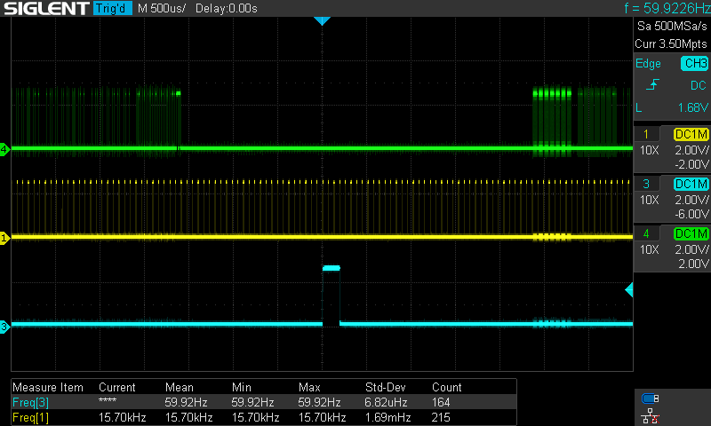

PICO TTL2VGA
==

### RPi Pico  TTL to VGA Converter  

Simple TTL (MDA/CGA/EGA) to VGA converter based on RPi Pico.<br />
VGA output is 720x400 (-31.4kHz/+70Hz).<br />
Input video modes:<br />
| mode       | resolution | frequency / polarity | pixel clock | VSYNC    | total lines |
|------------|------------|----------------------|-------------|----------|-------------|
| MDA        | 720x350    | H:+18.4kHz  V:-50Hz  |  16.257MHz  | 16 lines |   369       |
| CGA        | 640x200    | H:+15.7kHz  V:+60Hz  |  14.318MHz  |  3 lines |   262       |
| EGA Mode 1 | 640x200    | H:+15.7kHz  V:+60Hz  |  14.318MHz  |  3 lines |   262       |
| EGA Mode 2 | 640x350    | H:+21.8kHz  V:-60Hz  |  16.257MHz  | 13 lines |   364       |

Using the buttons, the pixel clock (horizontal width) can be adjusted.
In MDA and CGA/EGA the pallete can be toggled (GP21).

Tested with OAK067 and ET3000 EGA/VGA graphics cards, and two CGA cards.

#### Parts

  RPi Pico (RP2040)<br />
  11 $\times$ 499 &Omega; resistors<br />
  11 $\times$ 1k &Omega; resistors (group 8 in resistor network)<br />
  * optional<br />
    2 $\times$ 100 &Omega; resistors<br />
    DB9 male connector<br />
    DB15 female connector<br />
    4 buttons<br />
    1nF capacitor (optional, if VSYNC is noisy)

[Schematic](pico_ttl2vga.pdf)


#### Compile

  cf. [RPi Pico c/C++ SDK](https://github.com/raspberrypi/pico-sdk)
  ```
  cd src
  # (copy pico_sdk_import.cmake from the SDK)
  mkdir build && cd build
  cmake .. -DPICO_SDK_PATH=<path_to_pico_sdk>
  make
  ```
  If Pico 2 (SDK 2.0) is the target, add `-DPICO_BOARD=pico2` to `cmake`, i.e.
  ```
  cmake .. -DPICO_SDK_PATH=<path_to_pico_sdk> -DPICO_BOARD=pico2
  ```

#### Pico VGA output

  cf. https://vanhunteradams.com/Pico/VGA/VGA.html<br />

#### Remarks

1. Use at your own risk! Don't expect too much.

2. The 114 MHz system clock reduces jitter in the VGA output.<br />
   The input pixel clock will probably introduce jitter. The clock divider for the pixel clock can be adjusted (GP20/19). The parameters can be displayed `BUTTON_OSD` (GP18).<br />
   Doubling the system clock speed (228 MHz) helps adjusting the scan pixel clock and offset.<br />
   To reduce jitter, pixels must be sampled at the right time/position.<br />
   `BUTTON_OSD`: Enter menu<br />
   <br />
   `BUTTON_PAL`: Toggle menu item<br />
   `BUTTON_PLS`/`BUTTON_MIN`: Change value<br />
   `BUTTON_OSD`: Leave menu<br />
   Pixel clock and horizontal offset can also be change outside the menu.

3. If scanning starts too early, the last line would be missing. For normal use, a frame buffer of 720x351 (or 724x351) is recommended (see below). Once the best settings have been found, they can be set in `ttl_in.h`, e.g.
   ```C
   // 228MHz
   ttlmode_t mode_MDA    { .div_int  = 3, .div_frac =  42, .h_offset =  357 }
   ttlmode_t mode_EGA2   { .div_int  = 3, .div_frac =  42, .h_offset =  346 }
   ttlmode_t mode_CGAEGA { .div_int  = 4, .div_frac =   6, .h_offset = 1027 }
   ```
   (can be adjusted using `BUTTON_PLS`/`BUTTON_MIN`)<br />
   For OAK067,
   ```C
   //OAK
   ttlmode_t mode_CGAEGA { .div_int  = 4, .div_frac =   6 }  // 14.167MHz
   ttlmode_t mode_EGA2   { .div_int  = 3, .div_frac =  42 }  // 18.015MHz (18.015*640/720=16.013)
   //ET3000
   //ttlmode_t mode_EGA2 { .div_int  = 3, .div_frac = 129 }  // 16.268MHz
   ```
   shows no/minimal jitter.<br />
   Horizontal offset (scan back porch) can be adjusted by entering the menu `BUTTON_OSD`; select menu item using `BUTTON_PAL`; exit menu by pressing `BUTTON_OSD`.<br />
   In EGA Mode 2 there should be 350 visible lines, 13 lines vertical sync, and 364 total lines, i.e. not much room for front/back porch.<br />
   640x350 EGA Mode 2:<br />
   <br />
   640x200 CGA/EGA:<br />
   <br />
   720x350 MDA:<br />
   <br />

4. Use test images (e.g. CheckIt) to find the right pixel clocks.<br />
   640x200 EGA:<br />
   <br />
   640x350 EGA Mode 2:<br />
   <br />
   (The distortion is due to the camera angle.)

5. If USB output is enabled, the clock divider fractional part for the current video mode can be seen in a serial monitor. However, if `pico_enable_stdio_usb(ttl2vga 1)` is enabled, the frame buffer is limited to 720x350 (or 724x349).
   If `pico_enable_stdio_usb(ttl2vga 0)` is disabled, `vga_out.h:YACTIVE` and `ttl_in.h:YLNS_MDA` should be set to 351 lines. This would take into account variations between different graphics cards.

6. Hercules Monochrome Graphics:<br />
   <br />

7. VGA 720x400@70Hz (-31.4kHz/+70Hz):<br />
   Some monitors might output 640x400, thus MDA scan pixel clock of 16Mhz can be reduced to 8/9*16Mhz=14MHz using `BUTTON_PAL` or by setting
   ```C
   ttlmode_t mode_MDA { .xscanlrd = 720 }
   ```
   to
   ```C
   ttlmode_t mode_MDA { .xscanlrd = 640 }
   ```

8. Prototype board<br />
   <br />
   <br />
   <br />

9. CGA<br />
   Tested two CGA cards, both have precise 14.318 MHz pixel clock and 59.923 Hz vertical sync. Hence
   ```C
   //CGA
   ttlmode_t mode_CGA { .div_int  = 3, .div_frac = 251 }  // 14.320MHz
   ```
   With the right horizontal offset there is no jitter/shimmer.
   In textmode, card A needed `.h_offset = 1872` (rp2040/pico) or `.h_offset = 1582` (rp2350/pico2).
   The best offset for card B was `.h_offset = 1848` (rp2040/pico).<br />
   640x200 CGA:<br />
   <br />

10. Replacing the voltage dividers with a 74LVC245 did not make much difference.
   One of the CGA cards showed a floating pin 7 (reserved), and the 74LVC245 output was a constant logic 1. However, in EGA pin 7 is secondary blue, and the converter does not distinguish between CGA and EGA, leading to a blue background. A 10k pull-down resistor at pin 7 TTL input solved the problem.
   If the Pico input pins are 5V tolerant, no level shifter is needed.

